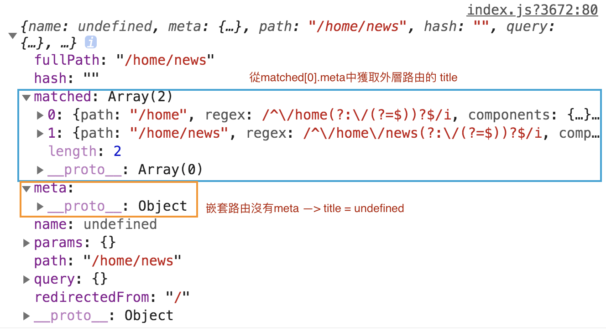

# webpack

## 02-webpack_config

解析過程基本上很簡單，並且可以區分三個變體：

> **絕對路徑：** require（“ / home / me / file”）
>
> **相對路徑：** require（“ ../ src / file”）或require（“ ./ file”）
>
> **模塊路徑**：require（“ module / lib / file”）

The base directory, an **absolute path**, for resolving entry points and loaders from configuration.

```js
const path = require('path');

module.exports = {
  //...
  context: path.resolve(__dirname, 'app'),
};
```

By default the current directory is used, but it's recommended to pass a value in your configuration. This makes your configuration independent from CWD (current working directory).

[Webpack: How to Create Dynamic Entry & Output paths](https://dev.to/bbenefield89/webpack-how-to-create-dynamic-entry-output-paths-1oc9)

**webpack.config.js**

```js
/**
 * When passed a string, Glob will attempt to find each file that matches the
 * path given and return each path to the file as string[]
 */
const glob = require('glob')

/**
 * The Path API will be used to get the absolute path to the directory where we
 * plan to run Webpack
 */
const path = require('path')

module.exports = {
    /**
     * Pass Glob a relative path to each of our entry points
     * We will have different subdirectories inside of the Project directory so
     * we need to replace any of the directory names with a wildcard, **, which 
     * will recursively match any combination of directory names inside of any
     * number of subdirectories until it finds the index.js entry.
     * Then we use the Array.prototype.reduce method to iterate through the array
     * and return an object containing a path to each of our entry files
     * (index.js)
     */
    entry: glob.sync('./Projects/**/index.js').reduce((acc, path) => {
        /**
         * The "[name]" placeholder in the "output" property will be replaced
         * with each key name in our "entry" object. We need to make sure the
         * keys are a path to the "index.js" file but without the actual file
         * name. This is why we replace the file name, "index.js", with a string
         */
        const entry = path.replace('/index.js', '')
        /**
         * Here we start building our object by placing the "entry" variable from
         * the previous line as a key and the entire path including the file name
         * as the value
         */
        acc[entry] = path
        return acc
    }, {}),

    /**
     * The "output" property is what our build files will be named and where the
     * build file will be placed
     */
    output: {
        /**
         * Again, the "[name]" place holder will be replaced with each key in our
         * "entry" object and will name the build file "main.js"
         */
        filename: './[name]/main.js',
        /**         
         * We need to provide an absolute path to the root of our project and
         * thats exactly what this line is doing
         */
        path: path.resolve(__dirname)
    }
}
```

------

## 03-webpack_loader

### Loading css

```shell
npm install webpack@3.6.0 -g #gobal

npm install webpack@3.6.0 --save-dev #local
# if you want to use local webpack(besure you are at current project want to pack)
# 1. relative path
# $ ./node_modules/.bin/webpack
# 2. package.json
  "scripts": {
		...,
    "build": "webpack"
   }
# $ npm run build

npm install --save-dev css-loader@2.0.2
# css-loader 只負責將css文件進行加載，不負責解析
npm install style-loader@0.23.1 --save-dev
# style-loader 負責將樣式添加到DOM中
```

webpack.config.js

```js
const path = require('path')

module.exports = {
	entry: './src/main.js',
	output: {
		path: path.resolve(__dirname, 'dist'),
		filename: 'bundle.js',
	},
	module: {
    rules: [
      { 
      	test: /\.css$/, 
        // css-loader 只負責將css文件進行加載，不負責解析
        // style-loader 負責將樣式添加到DOM中
        // when using multi loader, right first
      	use: ['style-loader', 'css-loader'] 
      },
    ],
  },
}
```

### loading .less

```shell
# special.less
$ npm install less@3.9.0 less-loader@4.0.1 --save-dev
```

webpack.config.js

```js
...
module: {
    rules: [
      { 
        test: /\.css$/, 
        // css-loader 只負責將css文件進行加載，不負責解析
        // style-loader 負責將樣式添加到DOM中
        // when using multi loader, right first
        use: ['style-loader', 'css-loader'] 
      },
      {
        test: /\.less$/i,
        use: [
          {
            loader: "style-loader",
          },
          {
            loader: "css-loader",
          },
          {
            loader: "less-loader",
            options: {
              lessOptions: {
                strictMath: true,
              },
            },
          },
        ],
      },
    ],
  },
    ...
```

### Loading img

```shell
# normal.css
body {
	/*background-color: orange;*/
	background: url("../img/gabo.jpg");
}
# img
npm install --save-dev url-loader@1.1.2
```

webpack.config.js

```js
      ...
      {
        test: /\.(png|jpg|gif)$/,
        use: [
          {
            loader: 'url-loader',
            options: {
              limit: 200
              // limit need to greater than image size(byte)
              // when the loading image size<limit, the image would be compiled as base64字符串形式
              // if image size>limit ==> error ==> need using file-loader module to compile
            }
          }
        ]
      }
      ...
```

file-loader	`(for case that image size>limit ==> error )`

```shell
npm install file-loader@3.0.1 --save-dev
```

#### Problem

File-loader would pack image int to string file, but the location is wrong after compile.


#### solution

webpack.config.js

```js
const path = require('path')

module.exports = {
	entry: './src/main.js',
	output: {
		path: path.resolve(__dirname, 'dist'),
		filename: 'bundle.js',
    publicPath: 'dist/'
    // after adding publicPath, 之後搜索到任合url的東西，都會自動在前面拼接上 dist/
	},
  ...
```


#### image name

webpack.config.js

```js
...			
			{
        test: /\.(png|jpg|gif|jpeg)$/,
        use: [
          {
            loader: 'url-loader',
            options: {
              limit: 200,
              // limit need to greater than image size(byte)
              // when the loading image size<limit, the image would be compiled as base64字符串形式
              // ifimage size>limit ==> error ==> need using file-loader module to compile
              
              name: 'img/[name].[hash:8].[ext]'
              // img/[name] ===> name is variable
              // img/name  ===> name is string
              // hash:8  ===> hash is 32位，太潮，只截取8位
            }
          }
        ]
      }
...
```


### es6 --> es5

```shell
npm install --save-dev babel-loader@7 babel-core@6 babel-preset-es2015@6
```

webpack.config.js

```js
	...
  	{
      test: /\.m?js$/,
      exclude: /(node_modules|bower_components)/,
      use: {
        loader: 'babel-loader',
        options: {
          presets: ['@babel/preset-env']
        }
      }
    }
	...
```


## 04-webpack_vue2

```shell
npm install vue --save
# do not use  --save-dev, which means the depandency only need during development, not need any more after compile
# but the vue project need both during development and distribution
```


```
vue has two version after compile

1. runtime-only  ==> you cannot have any template in your code

2. runtime-compiler  ==> you can have template in your code, since it has compiler to compile template in your code
```

### Vue pack error

```js
	//...
	module: {
		//...
  },
	resolve: {
    alias: {
      'vue$': 'vue/dist/vue.esm.js'
      // default runtime-only ===> change to runtime-compiler
    }
  }
    //...
```

### if vue not work correctly

If the output page is do not work correctly, delete the file in list, and run `npm run build` again.

### vue-loader

```shell
$ npm install vue-loader@15.4.2 vue-template-compiler@2.5.21 --save-dev

$ npm rum build
# ...
ERROR in ./src/vue/App.vue
vue-loader was used without the corresponding plugin. Make sure to include VueLoaderPlugin in your webpack config.
# ...
```

solution

```
if you are using version above vue-loader@14, you need another plugin in order to use App.vue file

1. degrade vue-loader under @14

	package.json
		"vue-loader": "^13.0.0",
		
	$ npm install

2. download plugin
	
```


```shell
$ npm rum build
# ...
Vue packages version mismatch:

- vue@2.6.12
- vue-template-compiler@2.5.21

This may cause things to work incorrectly. Make sure to use the same version for both.

------------------------------------------------
  package.json
  "vue-template-compiler": "^2.6.12",
```

#### 引用時省略檔案後綴

```vue
<script>
	import Cpn from './Cpn.vue'
  |
  v
<script>
	import Cpn from './Cpn'
```

webpack.config.js

```js
	// ...
	resolve: {
    // resolve extension name
    extensions: ['.js', '.css', '.vue'],
    // resolve path
    alias: {
      'vue$': 'vue/dist/vue.esm.js'
    }
  }
```

## 05-webpack_plugin

### copyright 

```js
const path = require('path')
const webpack = require('webpack')

module.exports = {
	entry: './src/main.js',
	output: {
		// ...
	},
	module: {
    // ...
  },
  resolve: {
    // ...
  },
  plugins: [
    new webpack.BannerPlugin('final copyright belong to webpack and vue')
  ]
}
```

result in bundle.js

```js
/*! final copyright belong to webpack and vue */
/******/ (function(modules) { // webpackBootstrap
```

### html packing

```shell
$ npm install html-webpack-plugin --save-dev
```

webpack.config.js

```js
const HtmlwebpackPlugin = require('html-webpack-plugin')
// ...
plugins: [
    new webpack.BannerPlugin('final copyright belong to webpack and vue'),
    new HtmlwebpackPlugin()
  ]
```


```shell
npm run build
--> fail

$ npm uninstall html-webpack-plugin
$ npm install html-webpack-plugin@3 --save-dev
```


`index.html` in dist folder

```html
<!DOCTYPE html> 
<html>
  <head>
    <meta charset="UTF-8">
    <title>Webpack App</title>
  </head>
  <body>
  <script type="text/javascript" src="dist/bundle.js"></script></body>
</html>
```

#### problem 1

```js
  <script type="text/javascript" src="dist/bundle.js">
    // src raletive path is wrong
```

solution:

webpack.config.js

```js
module.exports = {
	entry: './src/main.js',
	output: {
		path: path.resolve(__dirname, 'dist'),
		filename: 'bundle.js',
    // publicPath: 'dist/'
	},
```

#### problem 2

```html
<!DOCTYPE html> 
<html>
  <head>
    <meta charset="UTF-8">
    <title>Webpack App</title>
  </head>
  <body>
    <!-- <div id="app"></div>` is missing -->
  <script type="text/javascript" src="dist/bundle.js"></script>
  </body>
</html>
```


solution 

Index.html outer dist folder

```html
<!DOCTYPE html>
<html lang="en">
<head>
    <meta charset="UTF-8">
    <title>Title</title>
</head>
<body>

<div id="app"></div>
<!-- <script> would automactically produce after webpack with  html-webpack-plugin-->
</body>
</html>
```

webpack.config.js

```js
const HtmlwebpackPlugin = require('html-webpack-plugin')
// ...
plugins: [
    new webpack.BannerPlugin('final copyright belong to webpack and vue'),
    new HtmlWebpackPlugin({
      template: 'index.html'
    })
  ]
```

#### after fixed

`index.html` in dist folder

```html
<!DOCTYPE html>
<html lang="en">
<head>
    <meta charset="UTF-8">
    <title>Title</title>
</head>
<body>

<div id="app"></div>

<script type="text/javascript" src="bundle.js"></script></body>
</html>
```

### js compressing

```shell
npm install uglifyjs-webpack-plugin@1.1.1 --save-dev
```


```js
const UglifyjsWeboackPlugin = require('uglifyjs-webpack-plugin')

//...
  plugins: [
    new webpack.BannerPlugin('final copyright belong to webpack and vue'),
    new HtmlWebpackPlugin({
      template: 'index.html'
    }),
    new UglifyjsWeboackPlugin()
  ]
//...
```

### local server

Save the compileed file in memory rather in disk, which can enhance reading speed.

```shell
$ npm install --save-dev webpack-dev-server@2.9.1
# download locally

$ ./node_modules/.bin/webpack-dev-server
# use local 
```

package.json

```json
"scripts": {
    "test": "echo \"Error: no test specified\" && exit 1",
    "build": "webpack",
    "dev": "webpack-dev-server --open"
  },
```

- `"dev": "webpack-dev-server"` ==> run the project on http://localhost:8080/, but need to type in address by yourself

- `"dev": "webpack-dev-server --open"` ==> automatically open the tab/window for http://localhost:8080/ after typing `npm run dev`

```shell
$ npm run dev
```


## 06-webpack_seperate_config

There are some configure only needed during development, 

while others only needed during distribution, which means webpack

1. Create a` base.config.js`
2. Copy the content of` webpack.config.js` to ` base.config.js`
3. Create a folder name build, and move the base.config.js into it

```js
06-webpack_seperate_config ----
	|--- build
				|---- base.config.js //shared
				|---- dev.config.js	 //during development ==> dev+base
				|---- prod.config.js //final compiled ==> prod+base
	|--- dist
	|--- src
...
```

base.config.js

```js
//...
module.exports = {
  // ...
  plugins: [
    new webpack.BannerPlugin('final copyright belong to webpack and vue'),
    new HtmlWebpackPlugin({
      template: 'index.html'
    }),
    // new UglifyjsWeboackPlugin()
  ],
  // devServer: {
  //   contentBase: './dist',
  //   inline: true
  // }
}
```

dev.config.js

```js
module.exports = {
  devServer: {
    contentBase: './dist',
    inline: true
  }
}
```

prod.config.js

```js
const UglifyjsWeboackPlugin = require('uglifyjs-webpack-plugin')
module.exports = {
  plugins: [
    new UglifyjsWeboackPlugin()
  ],
}
```

### webpack-merge

in order to combine the dev+base, prod+base, install `webpack-merge`

```shell
$ npm install webpack-merge@4.1.5 --save-dev
```

dev.config.js

```js
const webpackMerge = require('webpack-merge')
const baseConfig = require('./base.config')

module.exports = webpackMerge(baseConfig, {
  devServer: {
    contentBase: './dist',
    inline: true
  }
})
```

prod.config.js

```js
const UglifyjsWeboackPlugin = require('uglifyjs-webpack-plugin')
const webpackMerge = require('webpack-merge')
const baseConfig = require('./base.config')

module.exports = webpackMerge(baseConfig, {
	plugins: [
    new UglifyjsWeboackPlugin()
  ]
})
```

package.json

```json
"scripts": {
    "test": "echo \"Error: no test specified\" && exit 1",
    "build": "webpack --config ./build/prod.config.js",
    "dev": "webpack-dev-server --config ./build/dev.config.js"
  },
```

#### problem

After separating the config, delete the content of diet folder and run `npm run build`.

Findout that the webpack is success but there is nothing in dist folder.

the compiled files are webpacked into a list folder in build


reason

base.config.js

```js
const path = require('path')
const webpack = require('webpack')
// ...

module.exports = {
	entry: './src/main.js',
	output: {
		path: path.resolve(__dirname, 'dist'), // 打包後的文件輸出位置：當前 base.config.js 所在的目錄，後面再拼接一個 dist(folder) === current filder(build)/add a dist folder === in build/dist/
		filename: 'bundle.js',
    //publicPath: 'dist/'
	},
  //...
}
```

Modified to

```js
const path = require('path')
const webpack = require('webpack')
// ...

module.exports = {
	entry: './src/main.js',
	output: {
		path: path.resolve(__dirname, '../dist'), // 打包後的文件輸出位置：當前 base.config.js 所在的上一層目錄，後面再拼接一個 dist(folder) === in 06-webpack_seperate_config/dist/
		filename: 'bundle.js',
    //publicPath: 'dist/'
	},
  //...
}
```

# Vue CLI

`CLI(command-Line Interface)`

```shell
npm install -g @vue/cli@3.2.1
```

[vue cli 3 升级到 vue cli 4 方法步骤及升级点总结](https://blog.csdn.net/qq_39953537/article/details/102759821)

[Migrating from v3](https://cli.vuejs.org/migrating-from-v3/#upgrade-all-plugins-at-once)

### Vue cli 2

vue cli 3 drag 2.x template

```shell
npm install -g @vue/cli-init
```

Create project

```shell
vue init webpack projectNmae
npm run dev
```


> Es(js)-Lint : 自動檢查代碼是否符合編寫規範
>
> e2e = end to end = 自動化測試框架 ( selenium )

First see the package.json

```json
"scripts": {
    "dev": "webpack-dev-server --inline --progress --config build/webpack.dev.conf.js",
    "start": "npm run dev",
    "lint": "eslint --ext .js,.vue src",
    "build": "node build/build.js"
  },
```


```js
"build": "node build/build.js"
		node build/build.js = execute build/build.js
		---> first remove 之前 dist folder 中編譯打包的文件，再從新根據 webpackConfig（import from 配置文件 webpack.prod.conf）重新編譯打包

"start": "npm run dev", // ==> npm run start = npm run dev
"dev": "webpack-dev-server --inline --progress --config build/webpack.dev.conf.js",
```

#### 目錄詳解：


- `config/index.js` ---> you can modified some variable int it to satisfy your need

- `node_modules` folder --->  all the "devDependencies" in package.json

- `static` folder ---> 內容物會原封不動複製到 dist folder after `npm run build`

  - `.gitkeep` ---> if the folder ( static ) is empty, git would still keep the folder while uploading

- `src/assets` ---> 內容物會根據 src folder 中代碼做處理，且會根據代碼重新命名

- `.babelrc` ---> es6 traslate to es5 時要讀取的配置文件

  ```js
  // 03-webpack_loader
  // es6 -> es5
  // npm install --save-dev babel-loader@7 babel-core@6 babel-preset-es2015@6
  之前範例的 webpack.config.js
  
  // ...
  module.exports = {		
  {
    module: {
      rules: [
    	// ...
        { 
          test: /\.m?js$/,
          exclude: /(node_modules|bower_components)/,
          use: {
            loader: 'babel-loader',
            options: {
              presets: ['es2015'] // <--- 不會生成 .babelrc
            }
          }
        },
       // ...
      ]
      // ...
  }
  ```

  如果是使用 babel-preset-env，則會自動生成 `.babelrc`

  ```json
  // package.json
  "devDependencies": {
      //...
      "babel-preset-env": "^1.3.2",
   		//...
  ```

  `.babelrc` 

  ```js
  {
    "presets": [
      ["env", {
        "modules": false,
        "targets": {
          "browsers": ["> 1%", "last 2 versions", "not ie <= 8"] // es6->es5，讓瀏覽器適配條件
        }
      }],
      "stage-2"
    ],
    "plugins": ["transform-vue-jsx", "transform-runtime"]
  }
  ```


- `.editorconfig` --> 代碼編寫格式
- `.eslintignore` --> the place don't want eslint 檢測是否符合編寫規範

- `package.json` --> 大概的版本
- `package.lock.json` ---> the specific accurate download verion in `node_modules` folder

#### runtimecompiler vs. runtime-only

> Close `Es(js)-Lint` ---> `projectname/config/index.js` --> useEslint: false


```js
runtime-compiler : 
	template -> ast -> render -> virtual dom -> real dom -> UI

runtime-only : 
	render -> virtual dom -> real dom -> UI
	- 效率更高，代碼量更少（不需要額外代碼將template轉成ast再render, which is what compiler does）
  - template in .vue file is already process by vue-template-compiler(webpack loader)，所以在 render 之前就已鏡被 vue-template-compiler 編譯成 render 函數
```


#### build vs dev


### vue cli3

```shell
vue create newprojectNmae
$ npm run serve
```

Package.json

```json
// less than vue-cli2, since 透過 @vue/cli-service 間接管理許多依賴的包
// ...
"scripts": {
    "serve": "vue-cli-service serve",
    "build": "vue-cli-service build"
  },
//...
"devDependencies": {
    "@vue/cli-plugin-babel": "^4.5.0",
    "@vue/cli-service": "^4.5.0",
    "vue-template-compiler": "^2.6.11"
  }
```

#### modify config

##### 1. vue ui

```shell
$ vue ui
```


vue version

the exactly version you are using during development (download version in node_modules)


##### 2. modify config file

```
# location
projectName/node_modules/@vue/cli-service/webpack.config.js
```


##### 3. create vue.config.js

 create vue.config.js under current project

# vue router

## 01-learnvuerouter

Download vue-router

```
npm install vue-router --save
```


```
[in project folder]$ npm run dev
```


### URL hash vs. html history

URL hash


html history

In browser console

```js
location.hash='www'
"www" // http://localhost:8080/www
history.pushState({},'','home')
undefined // http://localhost:8080/home
history.pushState({},'','about')
undefined // http://localhost:8080/about
history.pushState({},'','menu')
undefined // http://localhost:8080/menu
history.pushState({},'','demo')
undefined // http://localhost:8080/demo
history.back()
undefined // http://localhost:8080/menu#/
history.back()
undefined	// http://localhost:8080/about#/
```

In browser network


> NavigationDuplicated
>
> 解決方法：this.$router.push(path).catch(err => {}) 原因：路由路徑重複報錯，vue-router3.1後 push和replace方法返回promise。 promise被reject但是你沒有catch，所以報錯Uncaught。 3.1版本之前是通過傳回調函數捕獲錯誤，沒有回調就不會捕獲也不會報錯 參考官方issues：https://github.com/vuejs/vue-router/issues/2881#issuecomment-520554378

```js
// router/index.js

const routes = [
	{
		path: '',
		redirect: '/home' // dedault route for first enter
	},
  ...
]

export default new Router({
	// 配置路由和組建之間的映射關係
	routes,
  mode: 'history',
  linkActiveClass:'active'
})
// default mode: url hash  --> modify router by url hash --> http://localhost:8080/#/home
// mode: 'history' --> modify router by html history --> http://localhost:8080/home
// 3. 將 Router 對象傳入 Vue 實例中(main.js)
```


>  router-link --> tag/replace/active-class

### router-lazy-log

```js
// router/index.js
import Home from '../components/Home'
import About from '../components/About'
import User from '../components/User'
```

detail

```
$ npm run build
app...當前應用程序開發的所有代碼＝業務代碼
manifest...為了打包代碼做的底層支撐
vender...第三方提供
```


```js
// router/index.js
const Home = () => import('../components/Home')
const HomeNews = () => import('../components/HomeNews')
const HomeMessage = () => import('../components/HomeMessage')
```


### pass variable


```
params:
	- /user/:id
  - this.$route.params.id

query:
	- URL
	- scheme://host:port/path?query#fragment
```


### source code : $router vs. $route

```js
// vue-router-3.0.2/src/index.js
import { install } from './install'
...
export default class VueRouter {
  static install: () => void;
  static version: string;
...
VueRouter.install = install
VueRouter.version = '__VERSION__'

if (inBrowser && window.Vue) {
  window.Vue.use(VueRouter)
}
----------------------------------------------------------
// vue-router-3.0.2/src/install.js
export function install (Vue) {
  if (install.installed && _Vue === Vue) return
  install.installed = true

  _Vue = Vue
  ...
  
  // same as ==> Vue.prototype.$router = return this._routerRoot._router
  Object.defineProperty(Vue.prototype, '$router', {
    get () { return this._routerRoot._router }
  })

  Object.defineProperty(Vue.prototype, '$route', {
    get () { return this._routerRoot._route }
  })

  // register gobsl components
  Vue.component('RouterView', View)
  Vue.component('RouterLink', Link)

  const strats = Vue.config.optionMergeStrategies
  // use the same hook merging strategy for route hooks
  strats.beforeRouteEnter = strats.beforeRouteLeave = strats.beforeRouteUpdate = strats.created
}
```


- $router為VueRouter實例，想導航到不同URL，則使用$router.push方法。
- $route為當前router轉跳對象，裡面可獲取name, path, query, params等。

### navigationGuard --> change webpage title


```js
router.beforeEach((to, from, next) => {
  // 從跳 from 轉到 to
  // document.title = to.meta.title
  console.log(to);
  document.title = to.matched[0].meta.title // 嵌套路由
  next()
})

// meta: 元數據（描述數據的數據）
```

嵌套路由




### keep-alive

> 正規表達式逗號後面不能加空格 --> 報錯


## 02-tabber

### import path

```js
// 02-tabber/build/webpack.base.config.js

...
module.exports = {
  context: path.resolve(__dirname, '../'),
  entry: {
    app: './src/main.js'
  },
  output: {
    ...
  },
  resolve: {
    extensions: ['.js', '.vue', '.json'],
    alias: {
      '@': resolve('src'),
      // import TabBar from "@/components/tabbar/TabBar"
      // same as "../tabbar/TabBar"
    }
  },
    ...
}
```


```js
resolve: {
    extensions: ['.js', '.vue', '.json'],
    alias: {
      '@': resolve('src'),
      'assets': resolve('src/assets'),
      'components': resolve('src/components'),
      'views': resolve('src/views'),
    }
  },
    
if the path you are using is in 
  `import Component from "components/tabbar/Component"`
  you can derectly use the alias
  // self-defined alis seems to have some problem when using in in App.vue 
  
but if the path you are using is in src="path"
  you need to add '~' at front when using alis
 ` `
```


[[影片推薦\]瀏覽器中Javascript的運作機制](http://mis101bird.github.io/browserwork/)


# vuex

## 01-learnvuex

```
npm install vuex@3.0.1 --save
```


# axios

## 02-learningaxios

```
npm install axios@0.18.0 --save
```

main.js

```js
// ...
import axios from 'axios'

// ...

axios({
  // url: 'httpbin.org/'
  url: 'http://123.207.32.32:8000/home/multidata'
}).then(res => {
  console.log(res);
})
```


```js
default methods --> GET

- 假設 GET 表示信封內不得裝信件的寄送方式，如同是明信片一樣，你可以把要傳遞的資訊寫在信封(http-header)上，寫滿為止，價格比較便宜。
- 然而 POST 就是信封內有裝信件的寄送方式（信封有內容物），不但信封可以寫東西，信封內 (message-body) 還可以置入你想要寄送的資料或檔案，價格較貴。


- 使用 GET 的時候我們直接將要傳送的資料以 Query String（一種Key/Vaule的編碼方式）加在我們要寄送的地址(URL)後面，然後交給郵差傳送。
- 使用 POST 的時候則是將寄送地址(URL)寫在信封上，另外將要傳送的資料寫在另一張信紙後，將信紙放到信封裡面，交給郵差傳送。

method: 'get'
params: {key: value}

method: 'post'
data: {key: value}
```


# shopmall

##  CSS Reset 與 CSS normalize

[Day21：小事之 CSS Reset 與 CSS normalize](https://ithelp.ithome.com.tw/articles/10196528)

在 W3C 制訂 HTML 與 CSS 規格時，並沒有強制規定各家瀏覽器應該怎樣實作每一個 HTML tag 的 CSS 預設樣式，只有提供資訊參考的範例[1]，加上IE 獨霸的時期，那時候還沒有其他瀏覽器， CSS Reset 的需求主要落在 IE 各版本之間的調整，後來 Firefox、safari、Chrome 陸續出現，網頁設計師必須要針對每個瀏覽器去做調整，因此 CSS Reset 的需求漸漸增加。

### CSS Reset

有幾套常見的 CSS Reset

- [Reset CSS](https://meyerweb.com/eric/tools/css/reset/)，此為 Eric Meyer 的版本
- [HTML5 Reset Stylesheet](http://html5doctor.com/html-5-reset-stylesheet/)，HTML5 Doctor 網站修改自 Eric A. Meyer 的版本。
- [CSS Reset - YUI Library ](https://yuilibrary.com/yui/docs/cssreset/)，由 Yahoo UI Library v3 所提供的 CSS Reset 版本。

做法是把所有瀏覽器最不一致的地方強制歸 0，可以看到最一開始那一大串 html tag 的 margin、padding、border、outline 全都設為 0

優點是統整、重置了各個瀏覽器的樣式設定。
缺點是必須全部重新做設定，比較沒有彈性，而且在使用開發者工具時會看到一大坨的繼承鏈(inheritance chain)。

因此後來出現了 normalize.css [3]

### CSS Normalize

因為 reset.css 重置了各個瀏覽器的樣式設定，使得有些有用、常用標籤的默認樣式必須要重新設定，因為這個問題，有人開發出了 normalize.css [4]

在 Normalize.css 的官方頁面上點出了他們的目標：[5]

- 保留有用的瀏覽器默認設置，而不是將其刪除。
- 為廣泛的 HTML 元素提供一般化的樣式。
- 修正瀏覽器的 Bug 與不一致。
- 透過微妙的改善提高可用性。
- 有詳細的文檔來解釋代碼。(每個樣式都有註解是處理什麼問題。)

因此 Normalize.css 被使用在 [Twitter Bootstrap](http://getbootstrap.com/)、[HTML5 Boilerplate](https://html5boilerplate.com/)、[GOV.UK](https://www.gov.uk/)、[Rdio](http://www.rdio.com/)、[CSS Tricks](http://css-tricks.com/) 以及其他很多的 framework 和網站上。

最大的特色就是保留原本預設 HTML 標籤的樣式，僅針對不同瀏覽器與各版本間不相容的標籤進行些微調整。

目前 reset.css 與 normalize.css 都有人使用，可以針對需求擇一使用即可。

另外， reset.css 與 normalize.css 不論用哪一套，都是在一開始就要引入網頁，因為它的目的就是在一開始幫你將各瀏覽器之間的差異進行調整。


Public/index.html

```js
<link rel="icon" href="<%= BASE_URL %>favicon.ico">
  // <%= BASE_URL %> --> current path
```


```
npm install better-scroll@1.13.2
```


# VUE3

[重新認識 Vue.js | Kuro Hsu](https://book.vue.tw/)

